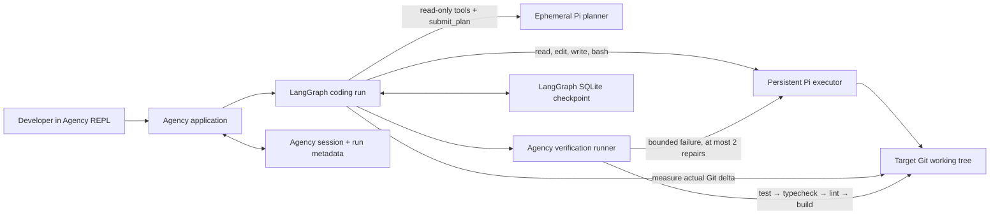

# Agency

Agency is a local, interactive coding-agent CLI for working inside an existing Git
repository. Give it a concrete change in plain language; it asks an embedded
[Pi coding agent](https://github.com/earendil-works/pi/tree/main/packages/coding-agent)
to inspect, plan, and edit the repository, then independently runs the repository's
own checks. If verification fails, Agency can return the bounded failure to the same
executor session for repair.

Phase 1 is implemented: repository discovery, persistent conversational context,
structured planning and editing through Pi, deterministic verification, up to two
repair attempts, SQLite graph checkpoints, startup recovery, safe lifecycle
trajectories, and the interactive commands documented below. It is an early local
developer tool, not a sandbox or a general multi-agent platform.

## Quick start

Requirements:

- Node.js 22.19 or newer
- npm
- a Pi-supported model provider configured before Agency starts

Pi supports subscription login and API-key providers. Follow Pi's
[quick start](https://github.com/earendil-works/pi/blob/main/packages/coding-agent/docs/quickstart.md)
and [provider guide](https://github.com/earendil-works/pi/blob/main/packages/coding-agent/docs/providers.md):
run Pi's `/login` flow or set the provider-specific environment variable described
there. Do not put credentials in this repository. Agency uses Pi's normal local
provider/model configuration and fails clearly when the selected model has no key.

Install and link this checkout:

```sh
node --version # must be >= 22.19
npm install
npm run build
npm link
```

Then enter a trusted Git repository and start Agency:

```sh
cd /path/to/your/project
agency
```

An abridged session looks like this (the plan, tools, files, and check count depend
on the target project and selected model):

```text
$ agency
Agency
Project: /work/calculator
Branch: main (clean)
agency> Make divide reject a zero divisor with a DivisionByZeroError and add a focused test.
Phase: preparing
Phase: planning
Tool: read
Phase: executing
Changed: src/divide.ts
Changed: test/divide.test.ts
Phase: verifying
Running: npm run test
Command passed: npm run test
Running: npm run typecheck
Command passed: npm run typecheck
Plan: Reject zero divisors with a typed error
  1. Add and throw DivisionByZeroError
  2. Cover zero and nonzero divisors
Changed files: src/divide.ts, test/divide.test.ts
Verification: passed — 2 verification commands passed
Done: 2 verification commands passed. 2 files changed.
agency> /status
Project: /work/calculator
Session: 7a2d…
Status: completed
agency> /exit
```

Agency never stages or commits the target repository.

## How it works



The responsibility split is deliberate:

| Component | Owns | Does not own |
| --- | --- | --- |
| Pi | Model/provider access; an ephemeral, read-only planner session; a persistent executor session with repository tools; focused implementation self-checks | Workflow state, authoritative changed-file detection, final verification, commits |
| LangGraph | The `prepare → plan → execute → verify → repair → summarize` state machine, conditional repair routing, thread checkpoints, and resume | Provider authentication, terminal UI, verification command implementation |
| Agency | Repository and instruction discovery, Git baseline/delta, session context, verification command detection/execution, incomplete-run registry, trajectories, REPL, rendering, cancellation, and lifecycle cleanup | Secure isolation, provider credentials, target-repository commits |

The embedded APIs and versions are pinned rather than floating:

| Package | Version | API used by Agency |
| --- | ---: | --- |
| `@earendil-works/pi-coding-agent` | `0.84.1` | `ModelRuntime.create`, `createAgentSession`, and in-memory/persistent `SessionManager` instances |
| `@langchain/langgraph` | `1.4.9` | `StateGraph`, conditional edges, checkpoint-aware invocation, and resume |
| `@langchain/langgraph-checkpoint-sqlite` | `1.0.3` | `SqliteSaver.fromConnString` for project-local durable checkpoints |
| `@langchain/core` | `1.2.5` | Compatibility pin for the LangChain/LangGraph stack |
| `zod` | `4.4.3` | Strict validation and bounds at runtime and persistence boundaries |

These are the exact versions in `package.json` and `package-lock.json`. In particular,
Agency uses Pi as an SDK—not by parsing a separate `pi` subprocess—and uses a fresh
planner session for every run while reusing one executor session per project so a
repair retains implementation context.

### Why verification is independent

The model that writes a change is not the authority on whether it works. After Pi
finishes editing, Agency recomputes changed files from the captured Git baseline and
runs the target project's detected npm scripts in a separate process boundary. It
does not accept Pi's changed-file report or focused self-checks as proof. This catches
mistaken success claims, missed files, and failures that only appear in the project's
full checks. A failed required command stops the verification sequence and supplies a
bounded failure record to the repair loop.

For Node projects, checks are detected from `package.json` and run in this fixed
order when present: `test`, `typecheck`, `lint`, `build`. If none exist, verification
is reported as skipped rather than passed.

## Project, session, and run

- A **project** is the target Git repository. Agency discovers its root, branch,
  package metadata, and repository instructions (`AGENTS.md`, `CLAUDE.md`,
  `CODEX.md`, and `.github/copilot-instructions.md`).
- A **session** is the bounded conversation stored for that project. Subsequent
  prompts receive recent user turns and terminal run summaries. `/new` replaces the
  active conversational context; it does not reset the working tree.
- A **run** is one non-command prompt through the coding graph. It has its own run ID
  and checkpoint thread, captures a Git baseline, produces a plan, edits, verifies,
  may repair, and ends completed or failed.

## Local state and recovery

Agency creates `.devagency/` in the target repository:

```text
.devagency/
├── session.json             # current bounded conversation and run summaries
├── incomplete-runs.json     # non-terminal run/thread discovery records
├── state.db                 # LangGraph SQLite checkpoints
├── pi-sessions/             # persistent Pi executor session data
└── runs/<run-id>.jsonl      # bounded lifecycle events and safe metadata
```

At startup, Agency compares incomplete-run records with checkpoint state. If a
matching checkpoint exists, it offers `r` to resume the newest resumable run or `n`
to start a fresh conversational session while preserving the recovery record.
Missing and stale checkpoints are reported and are not resumed. Ctrl+C cancels the
active model call; at an idle prompt it exits.

Agency adds `.devagency/` to the repository's local Git exclude file
(`.git/info/exclude`, resolved correctly for linked worktrees). This keeps machine
state out of normal diffs without modifying the project's shared `.gitignore`.
Treat the directory as Agency-owned local metadata: do not edit or commit it.
Trajectory files contain lifecycle names, timing, status, attempt, and changed-file
counts—not prompts, model responses, command output, or credentials.

## Interactive commands

| Command | Effect |
| --- | --- |
| `/help` | List commands |
| `/status` | Show repository, session, last-run, verification, and changed-file status |
| `/diff` | Show the current unstaged Git diff |
| `/verify` | Run detected project checks without asking Pi to edit |
| `/new` | Start a fresh conversational session |
| `/exit` | Exit Agency |

Slash commands take no arguments. Plain text starts a coding run.

## Development and testing

```sh
npm run typecheck
npm run lint
npm test
npm run build
```

`npm test` is the deterministic suite. It uses fake/mocked Pi SDK boundaries and
does not require network access or provider credentials. To exercise the real Pi
integration separately:

```sh
npm run acceptance:real-pi
```

The real acceptance script builds Agency, creates a temporary Git repository from
the divide fixture, drives two related prompts through the normally configured Pi
provider/model, checks the transcript and Git diff, and runs the fixture's tests and
typecheck. It requires a working provider configuration and can consume provider
quota. No claim is made here that it has passed in your environment; run it explicitly
after configuring Pi. `AGENCY_REAL_PI_TIMEOUT_MS` can override its 300000 ms timeout.

## Safety

Phase 1 is **not sandboxed**. Pi tools and verification commands run with the same
operating-system permissions as the `agency` process. Use Agency only in repositories
and with instructions you trust, review the diff, and keep secrets out of prompts and
the working tree. The local exclusion and redacted diagnostics improve hygiene; they
are not access control. See [SECURITY.md](./SECURITY.md) for the exact boundary.

## Roadmap

Phase 2 is intentionally narrow: add process sandboxing and enforce a policy for
dangerous commands. Until both exist, Agency remains a trusted-local-repository tool.
